# Velvet - Tiny yet Powerful Embeddable Web Rendering Library

Velvet is a tiny **cross-platform** web renderer written in C aiming for being as efficient as possible.
At this moment, Velvet supports only a limited subset of HTML and CSS, meaning Google or your favorite adult site will not work under Velvet, but this can change at any time! Every day Velvet gets support of a new tag or a new CSS property, so one day, you'll be able to use a Velvet-based web browser like any other one.

## Getting Started

Velvet uses `CMake` as a project generation tool and `vcpkg` as a package manager, so make sure to have all these wonderful tools installed. In the root of the repository lies the `CMakePresets.json` file providing the following configure presets:
* `vcpkg / vcpkg_debug` for compiling for the host OS
* `vcpkg_win / vcpkg_win_debug` for cross-compiling from any OS to Windows (x64)

> [!WARNING]
> Make sure to have `VCPKG_ROOT` environment variable set up, we rely on it heavily

With configure presets, compilation is pretty straightforward:
```
~ % cmake --preset vcpkg
~ % cmake --build .
```

## HTML / CSS Support Table

_Coming really really soon..._

## Gallery

<table border="1">
    <tr>
        <td>
            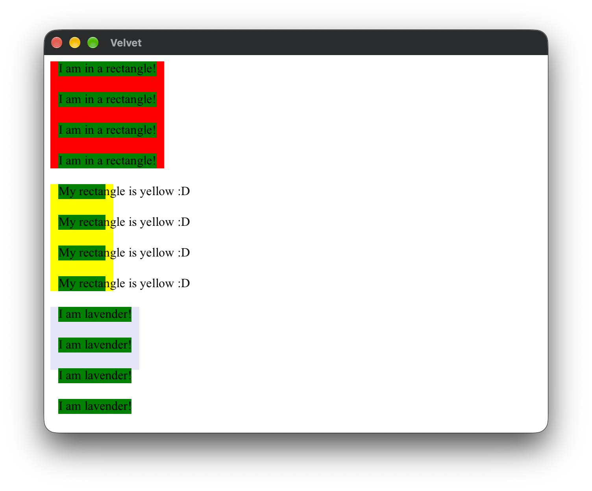
        </td>
        <td>
            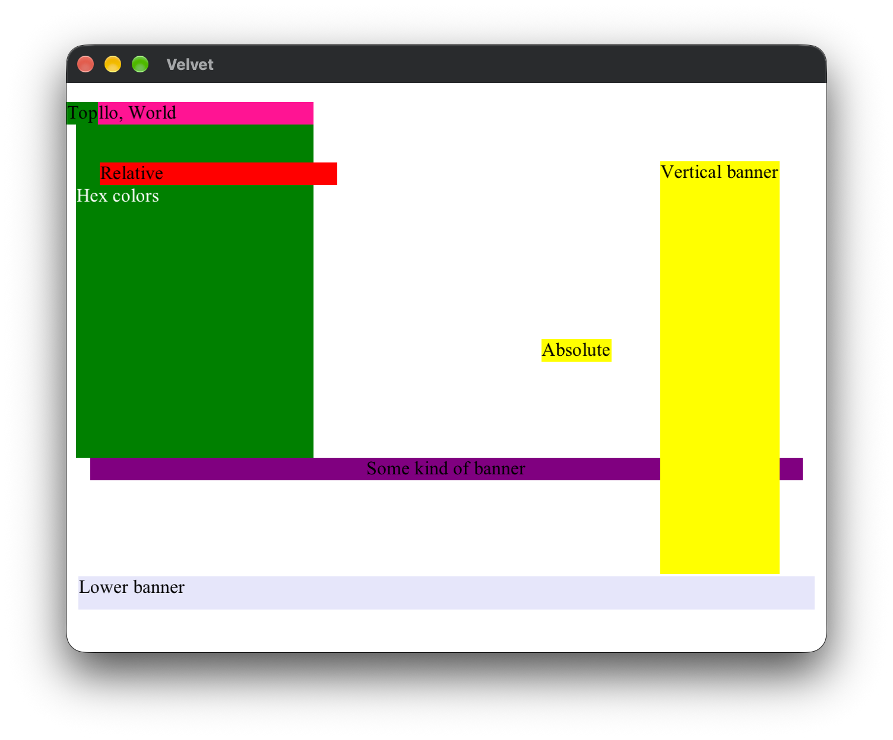
        </td>
    </tr>
    <tr>
        <td>
            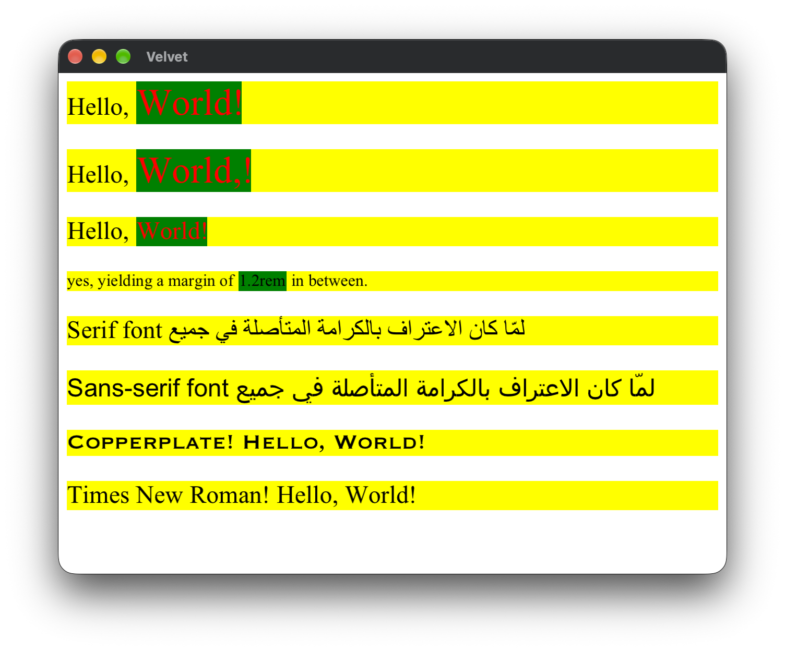
        </td>
        <td>
            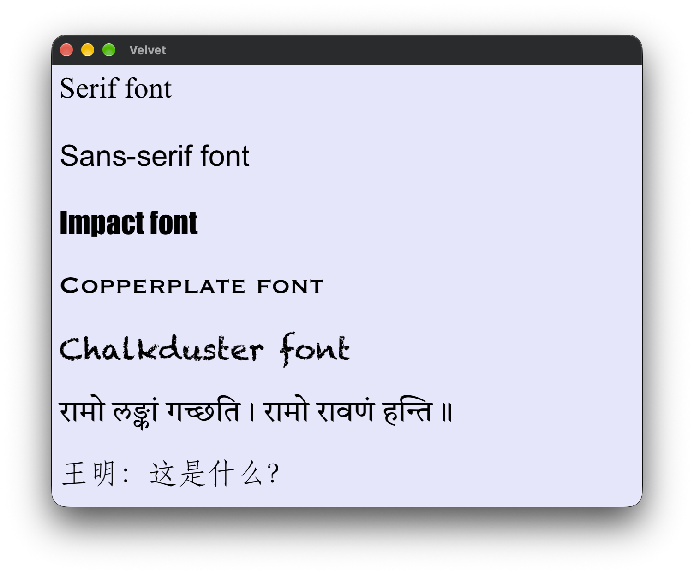
        </td>
    </tr>
    <tr>
        <td>
            
        </td>
        <td>
            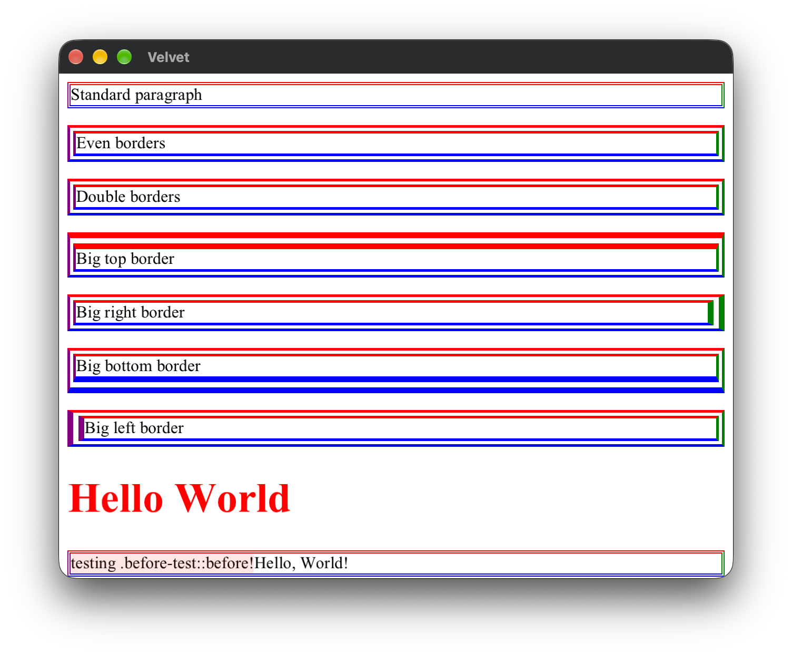
        </td>
    </tr>
    <tr>
        <td>
            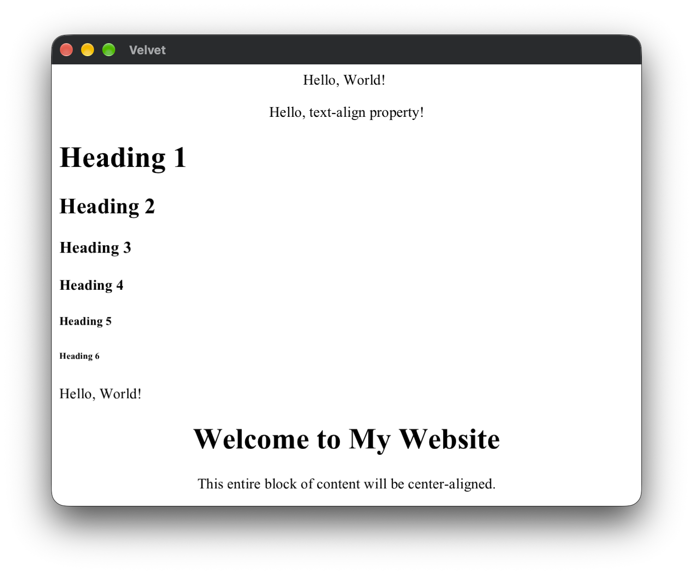
        </td>
        <td>
            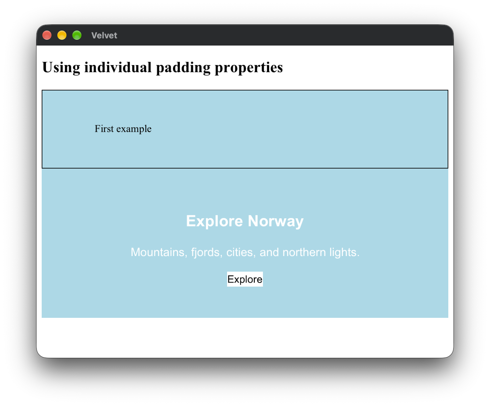
        </td>
    </tr>
    <tr>
        <td>
            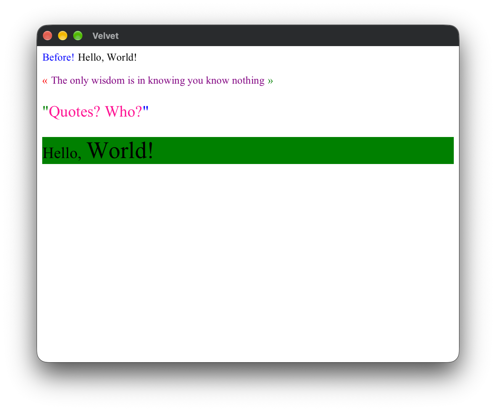
        </td>
        <td>
            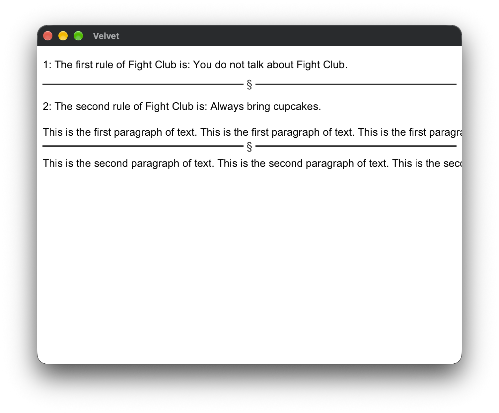
        </td>
    </tr>
    <tr>
        <td>
            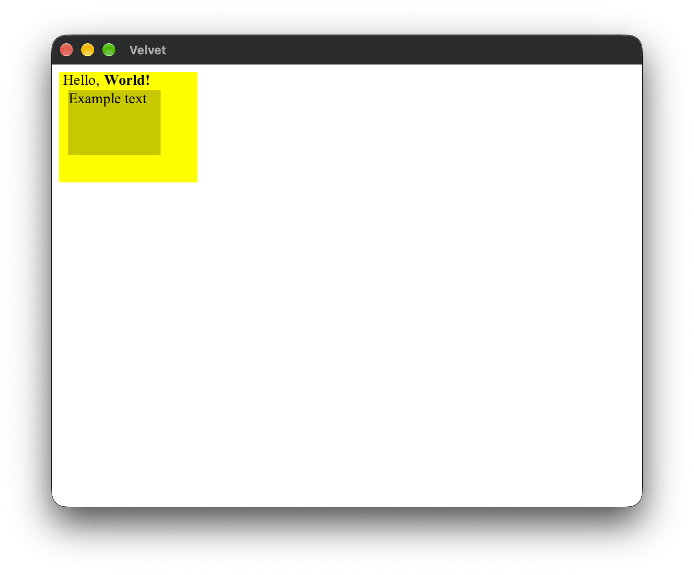
        </td>
        <td>
            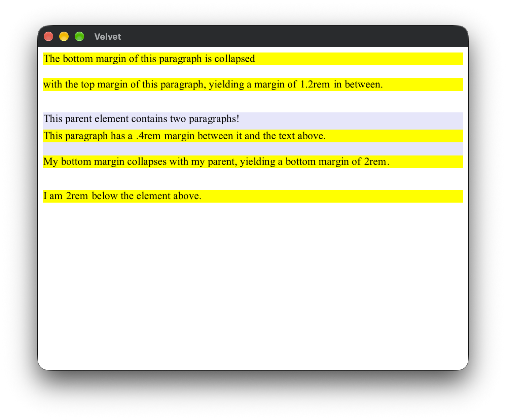
        </td>
    </tr>
</table>